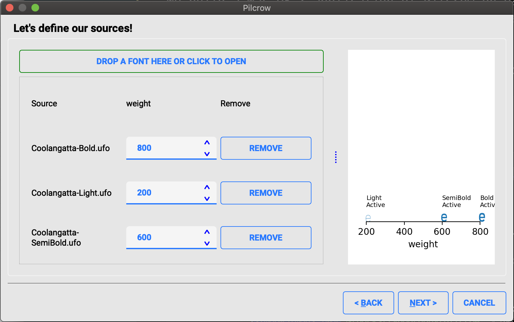

# Pilcrow

Pilcrow allows you to build variable fonts using a graphical interface.



## Running on Mac OS X

We build a Mac OS X application of Pilcrow on each commit, so it's
easiest to download the binary from [here](https://github.com/simoncozens/pilcrow/actions).

If you do want to build and run it yourself, though, you should run:

```
pip3 install -r requirements.txt
python3 setup.py py2app
open dist/Pilcrow.app
```

## Running on Windows

We'll get continuous deployment working here too, somehow, sometime...

## Running on Linux

```
pip3 install -r requirements.txt
python3 pilcrow.py
```

You may find that you need to install PyQt5 from your package manager (e.g.
`apt-get install python3-pyqt5`) in order to get the correct windowing system abstraction plugin thingy to run Qt on your window system.
