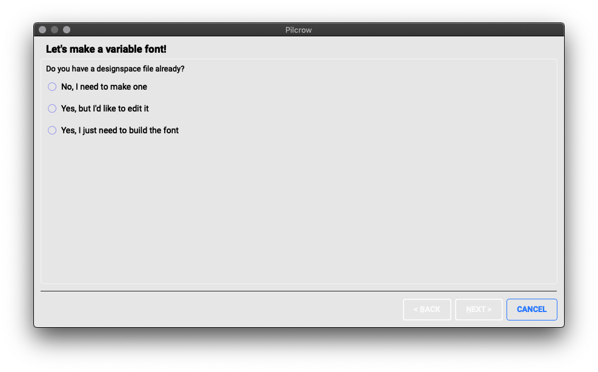
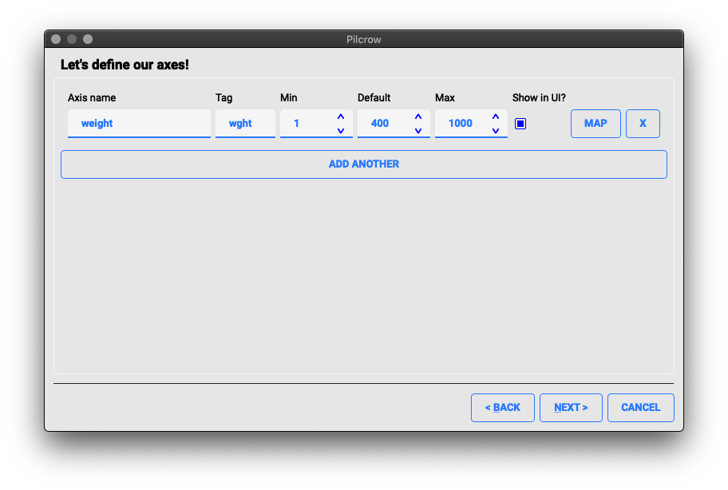
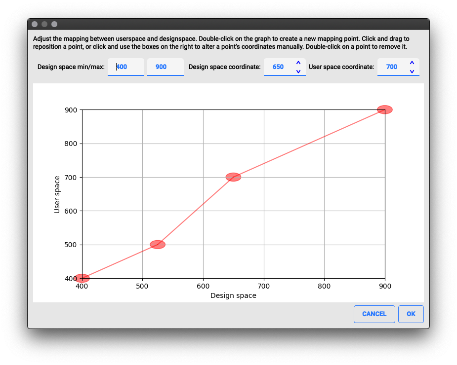
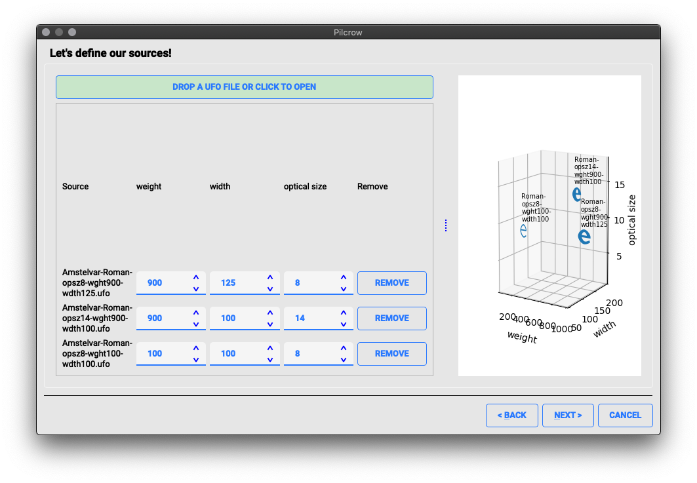
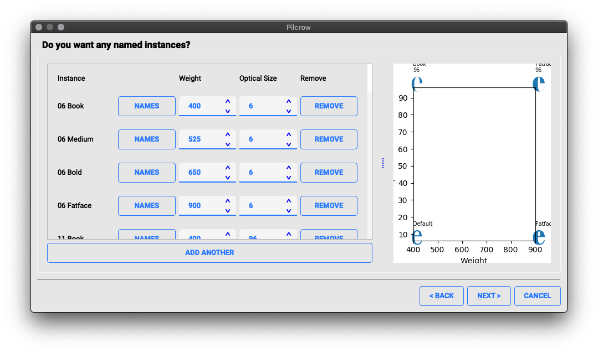
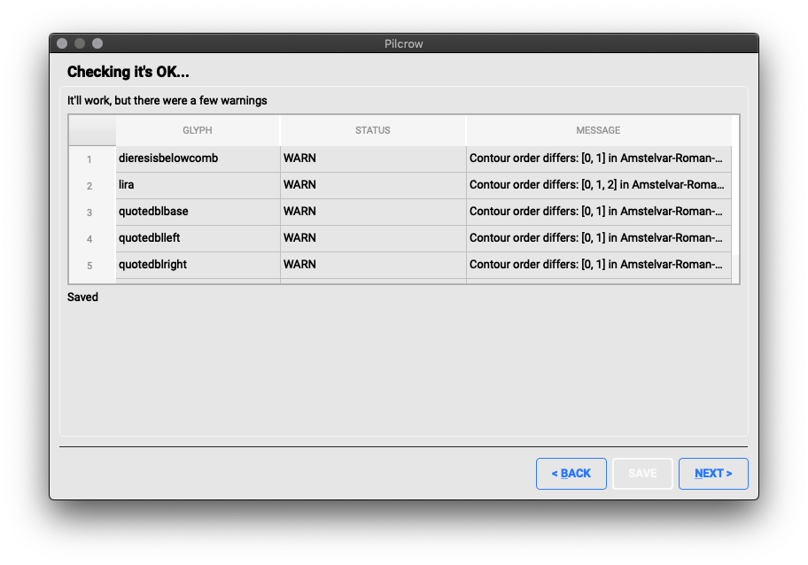
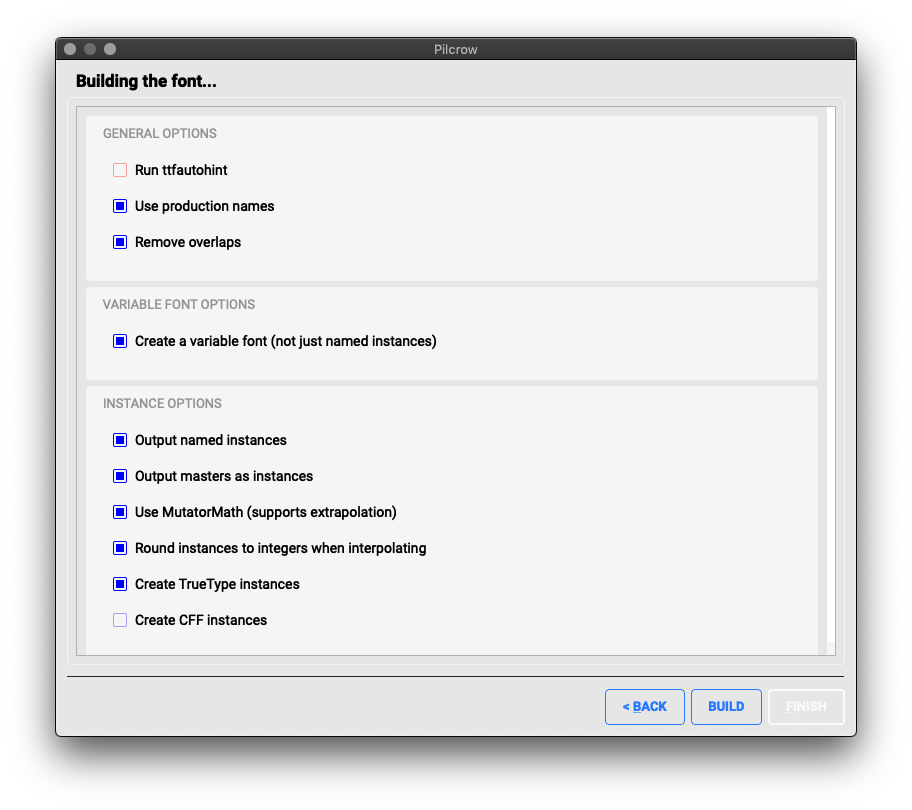

# Pilcrow

Pilcrow allows you to build variable fonts using a graphical interface.

## Building a font with Pilcrow

Here are the steps to building a designspace file and font.



The first page is hopefully obvious. If you don't have a `.designspace` file select the first option and click Next.

If you do, you have the choice to edit it or just to produce the font files. In either of those cases, you will be prompted to open the `.designspace` file.

### Defining Axes

Next, it is time to define the axes and their ranges in user-space coordinates.



If you type a known axis name or tag into the appropriate boxes, the min, default and max values are filled in for you. You can adjust these values as necessary either with the spinbox buttons *or by typing directly into the text field*.

To edit the mapping between user-space and design-space coordinates (the `avar` table), click on the Map button. This will bring up the map editor:



To use the map editor, double-click on the graph to create a new mapping point. You can click and drag to reposition a point, or click to select a point and use the boxes on the top right to alter a point's coordinates manually. Double-click on a point to remove it. To edit the full range of the designspace for this axis, use the boxes on the top left. Once you have done editing the `avar` mappings, press OK to return to the axes editor.

If there are any errors in your axis definitions, these will be highlighted and you will not be able to proceed. Once you are happy with your axes, press Next to go on to the sources editor.

### Editing sources

Now we move on to editing our sources.



The easiest way to do this is to drop a bunch of UFO files onto the button at the top. (You can drop single or multiple files, or you can click the button to bring up a file dialog.) Each source file will be added to the list of sources.

Each source will then need to be situated in the designspace, by assigning it a value to each of the axes. These values are specified in design space coordinates. To save you time, if your source filenames contain axis tags and values (for example, `Myfont-wdth-120.ufo` or `Myfont-opsz8-wght900.ufo`), the the appropriate locations are extracted from the filename and the form values automatically populated.

### Editing instances



If you have more than one source, you can create a variable font. Within that font, you may wish to define named instances; to do so, you use the Add button at the bottom of the form, and situate the instance on each axis in design space coordinates. You will then need to fill in the instance-specific names in Names form.

### Checking interpolatability

Next, Pilcrow will check whether your masters are compatible; if not, you will be told which glyphs have any problems.



Some problems are only advisory (such as differences in contour ordering) and will allow you to proceed to saving the `.designspace` file, but others (such as differing numbers of points in a contour, or differences in point types) will need to be fixed in the sources before you can continue.

### Building the font

The final pane actually controls the building of the font.



There are a number of options which control the generation. Many are self-explanatory; some of the less obvious ones are:

* **Run ttfautohint**: Automatically hint the output fonts. This option is only available if you have the `ttfautohint` executable installed. (To install on OS X, follow [these instructions](https://www.freetype.org/ttfautohint/osx.html).)
* **Use production names**: Renames glyph to production names (e.g. `uni0637` instead of `tah-ar`).
* **Output masters as instances**: Builds font files corresponding to each source master, whether or not they are defined as static instances.
* **Use MutatorMath**: Uses a separate Python library to generate the instances, which supports extrapolation and anisotropic locations.

When you have selected your options, press build, and all being well, the font files will be generated in the same directory as your designspace file. If there were any problems, pressing "show details" in the dialog box will provide an explanation.

## Running on Mac OS X

We build a Mac OS X application of Pilcrow on each commit, so it's
easiest to download the binary from [here](https://github.com/simoncozens/pilcrow/actions).

If you do want to build and run it yourself, though, you should run:

```
pip3 install -r requirements.txt
python3 setup.py py2app
open dist/Pilcrow.app
```

## Running on Windows

We'll get continuous deployment working here too, somehow, sometime...

## Running on Linux

```
pip3 install -r requirements.txt
python3 pilcrow.py
```

You may find that you need to install PyQt5 from your package manager (e.g.
`apt-get install python3-pyqt5`) in order to get the correct windowing system abstraction plugin thingy to run Qt on your window system.
